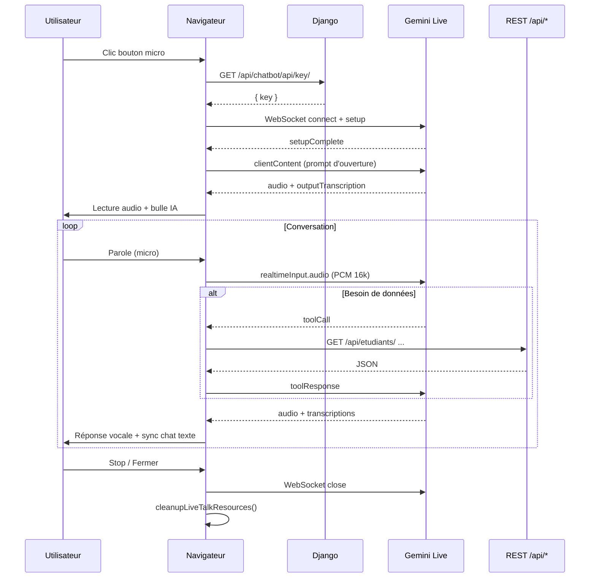

# Guide d’implémentation — 3.1 Live Preview (Conversation vocale FCRA)

Ce guide décrit l’implémentation de la **conversation vocale en direct** dans le chatbot FCRA, basée sur la **Gemini Live API** (WebSocket bidirectionnel). L’objectif initial était d’utiliser le modèle `gemini-3.1-flash-live-preview` ; le projet utilise actuellement un modèle Live audio stable (voir [§ Modèle](#modèle-gemini)).

---

## Table des matières

1. [Vue d’ensemble](#1-vue-densemble)
2. [Architecture](#2-architecture)
3. [Prérequis](#3-prérequis)
4. [Backend Django](#4-backend-django)
5. [Frontend — interface](#5-frontend--interface)
6. [Frontend — WebSocket Live API](#6-frontend--websocket-live-api)
7. [Pipeline audio](#7-pipeline-audio)
8. [Outils (function calling)](#8-outils-function-calling)
9. [Transcription et fil de discussion](#9-transcription-et-fil-de-discussion)
10. [Modèle Gemini](#10-modèle-gemini)
11. [Flux complet (séquence)](#11-flux-complet-séquence)
12. [Dépannage](#12-dépannage)
13. [Checklist de test](#13-checklist-de-test)
14. [Fichiers concernés](#14-fichiers-concernés)

---

## 1. Vue d’ensemble

| Élément | Détail |
|--------|--------|
| **Fonctionnalité** | Parler à l’assistant FCRA en temps réel (audio + transcription) |
| **API Google** | [Gemini Live API](https://ai.google.dev/gemini-api/docs/live) — WebSocket `BidiGenerateContent` |
| **Modèle cible (3.1)** | `models/gemini-3.1-flash-live-preview` |
| **Modèle en production (actuel)** | `models/gemini-2.5-flash-native-audio-preview-12-2025` |
| **Données** | Mêmes outils que le chat texte (étudiants, orphelins, stats…) |
| **Auth** | Utilisateur Django **connecté** obligatoire |

L’utilisateur clique sur le bouton micro rouge → une modale s’ouvre → connexion WebSocket → l’IA se présente à voix haute → l’utilisateur pose des questions oralement → Gemini appelle les outils REST si besoin → réponses audio + texte dans la modale **et** dans le fil principal du chat.

---

## 2. Architecture

```
┌─────────────────┐     GET /api/chatbot/api/key/      ┌──────────────────┐
│  Navigateur     │ ─────────────────────────────────► │  Django (auth)   │
│  chatbot.html   │ ◄───────────────────────────────── │  GEMINI_API_KEY  │
└────────┬────────┘                                     └──────────────────┘
         │
         │ WebSocket wss://generativelanguage.googleapis.com/ws/...BidiGenerateContent
         ▼
┌─────────────────┐
│  Gemini Live    │  toolCall → executeTool() → fetch /api/etudiants/, /api/statistics/, …
│  (Google)       │  toolResponse ← JSON résultat
└─────────────────┘
         │
         │ audio PCM 24 kHz (réponse) + transcriptions
         ▼
┌─────────────────┐
│  Web Audio API  │  micro 16 kHz → realtimeInput.audio
│  + Canvas viz   │  lecture file d’attente PCM
└─────────────────┘
```

**Principe de sécurité :** la clé `GEMINI_API_KEY` n’est **jamais** embarquée dans le HTML. Elle est servie uniquement via un endpoint authentifié.

---

## 3. Prérequis

### Variables d’environnement

```env
GEMINI_API_KEY=votre_cle_google_ai
```

Fichier `.env` à la racine du projet (lu par `python-decouple`).

### Dépendances

- Django + Django REST Framework
- `google-generativeai` (chat texte)
- Navigateur avec :
  - `getUserMedia` (micro)
  - WebSocket
  - Web Audio API
  - (Optionnel) `SpeechRecognition` / `webkitSpeechRecognition` pour transcription locale

### Permissions navigateur

- HTTPS ou `localhost` pour le micro
- Autorisation microphone à l’ouverture de la session Live

---

## 4. Backend Django

### 4.1 Endpoint clé API

**Fichier :** `api/views.py`

```python
@api_view(['GET'])
@permission_classes([IsAuthenticated])
def get_gemini_key(request):
    if not GEMINI_API_KEY:
        return Response(
            {'error': 'GEMINI_API_KEY manquante dans la configuration serveur.'},
            status=status.HTTP_503_SERVICE_UNAVAILABLE,
        )
    return Response({'key': GEMINI_API_KEY})
```

### 4.2 Route URL

**Fichier :** `api/urls.py`

```python
path('chatbot/api/key/', get_gemini_key, name='get_gemini_key'),
```

URL complète : **`GET /api/chatbot/api/key/`**

| Méthode | Auth | Réponse |
|---------|------|---------|
| GET | Session Django (connecté) | `{ "key": "..." }` |
| GET | Non connecté | 403 |
| GET | Clé absente | 503 |

### 4.3 APIs réutilisées par les outils Live

Les outils côté client appellent les mêmes endpoints que le chatbot texte :

| Outil Live | Endpoint REST |
|------------|----------------|
| `get_etudiants` | `GET /api/etudiants/` |
| `get_orphelins` | `GET /api/orphelins/` |
| `get_internationaux` | `GET /api/international/` |
| `get_universites` | `GET /api/universite/` |
| `get_statistics*` | `GET /api/statistics/?category=...` |

Aucun code backend supplémentaire n’est requis pour les outils Live : l’exécution se fait **dans le navigateur** via `fetch()`.

---

## 5. Frontend — interface

**Fichier :** `api/templates/api/chatbot.html`

### 5.1 Bouton d’entrée

Bouton micro à côté du champ de saisie :

```html
<button type="button" id="live-talk-btn" title="Conversation vocale en direct">
    <i class="fas fa-microphone"></i>
</button>
```

### 5.2 Modale Live Talk

Structure principale :

| ID | Rôle |
|----|------|
| `live-talk-modal` | Overlay plein écran |
| `live-audio-canvas` | Visualiseur circulaire (onde audio) |
| `live-status-dot` / `live-status-text` | État connexion / écoute / parole |
| `live-error-text` | Messages d’erreur |
| `live-tool-indicator` | Spinner pendant un appel d’outil |
| `live-conversation-log` | Bulles de transcription en direct |
| `mute-mic-btn` | Couper / activer le micro |
| `stop-live-talk-btn` | Terminer la session |
| `close-live-talk-btn` | Fermer la modale |

### 5.3 États visuels

| État | Indicateur |
|------|------------|
| Connexion | Point jaune, texte « Connexion... » |
| IA parle | Point bleu, visualiseur bleu |
| À l’écoute | Point vert animé |
| Micro coupé | Icône barrée, gris |
| Erreur | Point rouge + `live-error-text` |

---

## 6. Frontend — WebSocket Live API

### 6.1 Constante modèle

```javascript
const LIVE_MODEL = 'models/gemini-2.5-flash-native-audio-preview-12-2025';
// Pour tester 3.1 Live Preview :
// const LIVE_MODEL = 'models/gemini-3.1-flash-live-preview';
```

### 6.2 URL WebSocket

```javascript
const wsUrl =
  `wss://generativelanguage.googleapis.com/ws/` +
  `google.ai.generativelanguage.v1beta.GenerativeService.BidiGenerateContent` +
  `?key=${encodeURIComponent(apiKey)}`;

liveTalkSocket = new WebSocket(wsUrl);
liveTalkSocket.binaryType = 'arraybuffer';
```

### 6.3 Message `setup` (envoyé à l’ouverture)

```javascript
{
  setup: {
    model: LIVE_MODEL,
    generationConfig: {
      responseModalities: ['AUDIO'],
      speechConfig: {
        voiceConfig: {
          prebuiltVoiceConfig: { voiceName: 'Aoede' }
        }
      }
    },
    inputAudioTranscription: {},
    outputAudioTranscription: {},
    systemInstruction: {
      parts: [{
        text: "Tu es l'assistant vocal FCRA. ... Réponds en français. Utilise les outils pour les données réelles."
      }]
    },
    tools: toolsConfig   // functionDeclarations (9 outils)
  }
}
```

### 6.4 Cycle de vie

1. **`onopen`** → envoi du `setup`
2. **`setupComplete`** → session prête → `sendLiveOpeningPrompt()` → IA se présente
3. **`turnComplete`** → micro activé (`liveMicEnabled = true`)
4. **`toolCall`** → `executeTool()` → `toolResponse`
5. **`onclose` / erreur** → `showLiveError()` + nettoyage

### 6.5 Démarrage (`startLiveTalk`)

Ordre d’initialisation :

```text
1. Afficher la modale
2. GET /api/chatbot/api/key/  (credentials + CSRF)
3. new AudioContext()
4. initVisualizer()
5. initWebSocket(apiKey)        → attend setupComplete
6. initMicrophone()             → getUserMedia + ScriptProcessor
7. initSpeechRecognition()      → optionnel, fr-FR
```

### 6.6 Arrêt (`stopLiveTalk`)

```text
finalizeAllLiveBubbles(true)   → sync vers le fil principal
cleanupLiveTalkResources()     → fermer WS, micro, audio, canvas
hideLiveTalkModal()
```

---

## 7. Pipeline audio

### 7.1 Entrée micro → Gemini

| Paramètre | Valeur |
|-----------|--------|
| Format envoyé | PCM 16 bits, mono |
| Fréquence | **16 kHz** |
| Encodage | Base64 dans JSON |
| MIME | `audio/pcm;rate=16000` |

Message WebSocket :

```javascript
{
  realtimeInput: {
    audio: {
      mimeType: 'audio/pcm;rate=16000',
      data: '<base64 PCM>'
    }
  }
}
```

**Downsample :** `downsampleAndEncode(float32Array, inputSampleRate, 16000)` — moyenne par fenêtre puis conversion Int16.

**Graph audio (important) :** le `ScriptProcessor` doit être connecté à un nœud muet (`silentGainNode.gain = 0`) vers `destination`, sinon `onaudioprocess` ne se déclenche pas dans certains navigateurs.

**Anti-écho :** ne pas envoyer d’audio pendant `isPlayingAudio === true`.

### 7.2 Sortie Gemini → haut-parleurs

| Paramètre | Valeur |
|-----------|--------|
| Format reçu | PCM 16 bits base64 |
| Fréquence lecture | **24 kHz** |
| Mécanisme | File d’attente `audioQueue` + `processAudioQueue()` |

Extraction depuis le message serveur :

```javascript
const audioData = part.inlineData?.data || part.inline_data?.data;
if (audioData) queueAudioChunk(audioData);
```

### 7.3 Visualiseur

- `AnalyserNode` sur le micro et sur la sortie audio
- Canvas `#live-audio-canvas` — barres radiales 60 segments
- `requestAnimationFrame` dans `drawVisualizer()`

---

## 8. Outils (function calling)

### 8.1 Déclarations (`toolsConfig`)

Neuf fonctions déclarées côté client (miroir du chat texte) :

- `get_etudiants`, `get_orphelins`, `get_internationaux`, `get_universites`
- `get_statistics`, `get_statistics_etudiant`, `get_statistics_orphelin`, `get_statistics_international`, `get_statistics_universite`

### 8.2 Exécution (`executeTool`)

```javascript
async function executeTool(name, args) {
  // Construit l’URL REST selon le nom
  const response = await fetch(url, {
    credentials: 'same-origin',
    headers: { 'X-CSRFToken': getCookie('csrftoken') }
  });
  return await response.json();
}
```

### 8.3 Réponse à Gemini

```javascript
liveTalkSocket.send(JSON.stringify({
  toolResponse: {
    functionResponses: [{
      id: call.id,
      name: call.name,
      response: { result: result }
    }]
  }
}));
```

---

## 9. Transcription et fil de discussion

### 9.1 Sources de texte

| Source | Rôle |
|--------|------|
| `serverContent.inputTranscription` | Parole utilisateur (Gemini) |
| `serverContent.outputTranscription` | Réponse IA (Gemini) |
| `SpeechRecognition` (navigateur) | Fallback transcription locale `fr-FR` |
| `modelTurn.parts[].text` | Texte brut si pas de transcription audio |

### 9.2 Bulles streaming

Fonctions clés :

- `createLiveBubble(role, text, isStreaming)`
- `updateLiveStreamingBubble(role, text)`
- `finalizeLiveBubble(role, syncToMain)` — retire le point animé, copie dans `#chat-messages` via `addMessage()`

À la fin de chaque tour (`turnComplete`), `finalizeAllLiveBubbles(true)` synchronise modale + fil principal.

---

## 10. Modèle Gemini

### Modèle cible : `gemini-3.1-flash-live-preview`

Demandé pour une conversation « agent-like » en direct. Pour l’activer :

```javascript
const LIVE_MODEL = 'models/gemini-3.1-flash-live-preview';
```

### Modèle actuel en code

```javascript
const LIVE_MODEL = 'models/gemini-2.5-flash-native-audio-preview-12-2025';
```

**Pourquoi le changement ?** Lors des tests, `gemini-3.1-flash-live-preview` peut provoquer une fermeture WebSocket immédiate selon la région, le quota ou la compatibilité des `tools` en setup. Le modèle **native audio preview 12-2025** supporte audio + transcriptions + function calling de façon plus stable.

### Autres modèles Live testables

```
models/gemini-2.5-flash-live-preview
models/gemini-2.0-flash-live-001
models/gemini-2.5-flash-preview-native-audio-dialog
```

Lister les modèles disponibles :

```http
GET https://generativelanguage.googleapis.com/v1beta/models?key=VOTRE_CLE
```

Filtrer ceux contenant `live`, `native`, ou `audio`.

---

## 11. Flux complet (séquence)



---

## 12. Dépannage

| Symptôme | Cause probable | Action |
|----------|----------------|--------|
| « Vous devez être connecté » | Session expirée | Se reconnecter à Django |
| WebSocket fermé immédiatement | Mauvais modèle / clé invalide | Vérifier `GEMINI_API_KEY`, tester un autre `LIVE_MODEL` |
| Pas de parole entendue | `AudioContext` suspendu | Clic utilisateur requis ; `audioContext.resume()` |
| Micro ne envoie rien | Graphe audio incomplet | Vérifier `silentGainNode` connecté |
| Écho | Micro actif pendant lecture | Vérifier `if (isPlayingAudio) return` |
| Outils échouent | CSRF / auth REST | `credentials: 'same-origin'` + cookie session |
| Pas de transcription | Navigateur sans Speech API | Normal ; s’appuyer sur `inputTranscription` Gemini |
| Erreur 503 sur `/key/` | `.env` sans clé | Ajouter `GEMINI_API_KEY` |

### Test WebSocket minimal (Python)

Script de diagnostic (à exécuter localement avec `websockets` installé) :

```python
import asyncio, json
from decouple import config

async def test_model(model: str):
    import websockets
    key = config("GEMINI_API_KEY")
    url = (
        "wss://generativelanguage.googleapis.com/ws/"
        "google.ai.generativelanguage.v1beta.GenerativeService.BidiGenerateContent"
        f"?key={key}"
    )
    async with websockets.connect(url) as ws:
        await ws.send(json.dumps({
            "setup": {
                "model": model,
                "generationConfig": {
                    "responseModalities": ["AUDIO"],
                    "speechConfig": {
                        "voiceConfig": {
                            "prebuiltVoiceConfig": {"voiceName": "Aoede"}
                        }
                    }
                }
            }
        }))
        msg = await asyncio.wait_for(ws.recv(), timeout=15)
        print(model, "=>", msg[:500])

asyncio.run(test_model("models/gemini-3.1-flash-live-preview"))
```

---

## 13. Checklist de test

- [ ] Utilisateur connecté peut ouvrir la modale Live
- [ ] Utilisateur non connecté reçoit une erreur claire
- [ ] Statut passe de « Connexion... » à « L'IA parle... » puis « À l'écoute... »
- [ ] Audio de présentation audible
- [ ] Question orale : « Combien d'étudiants actifs ? » → outil stats → réponse vocale
- [ ] Transcription visible dans la modale
- [ ] Messages finalisés apparaissent dans le fil principal du chat
- [ ] Bouton mute coupe l’envoi micro
- [ ] Stop ferme proprement WS + micro
- [ ] Pas d’erreur console sur fermeture normale

---

## 14. Fichiers concernés

| Fichier | Contenu Live Preview |
|---------|---------------------|
| `api/views.py` | `get_gemini_key`, `chatbot_view` |
| `api/urls.py` | Route `/api/chatbot/api/key/` |
| `api/templates/api/chatbot.html` | UI modale, WebSocket, audio, outils, transcription |
| `.env` | `GEMINI_API_KEY` |
| `AGENTS.md` | Documentation agent chat texte (complémentaire) |

---

## Résumé

La **Live Preview 3.1** est une couche **100 % frontend** (WebSocket + Web Audio) appuyée sur :

1. **Un seul endpoint Django** pour la clé API (`get_gemini_key`)
2. **Les APIs REST existantes** pour les outils
3. **Gemini Live API** pour la conversation bidirectionnelle audio

Pour basculer vers **`gemini-3.1-flash-live-preview`**, changez uniquement la constante `LIVE_MODEL` dans `chatbot.html`, testez la connexion WebSocket, et gardez le modèle 2.5 native audio en repli si la session se ferme aussitôt.
