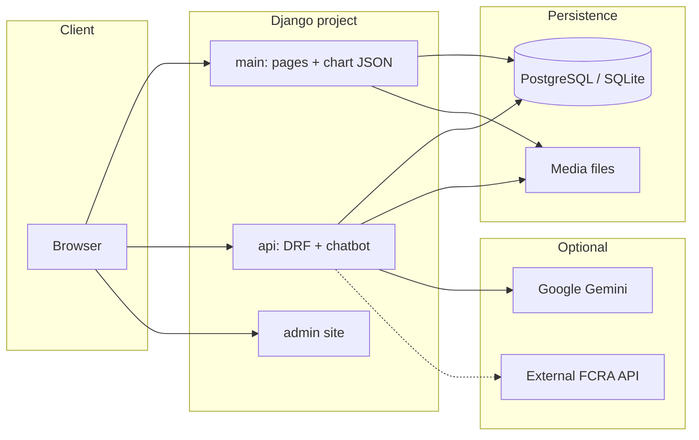
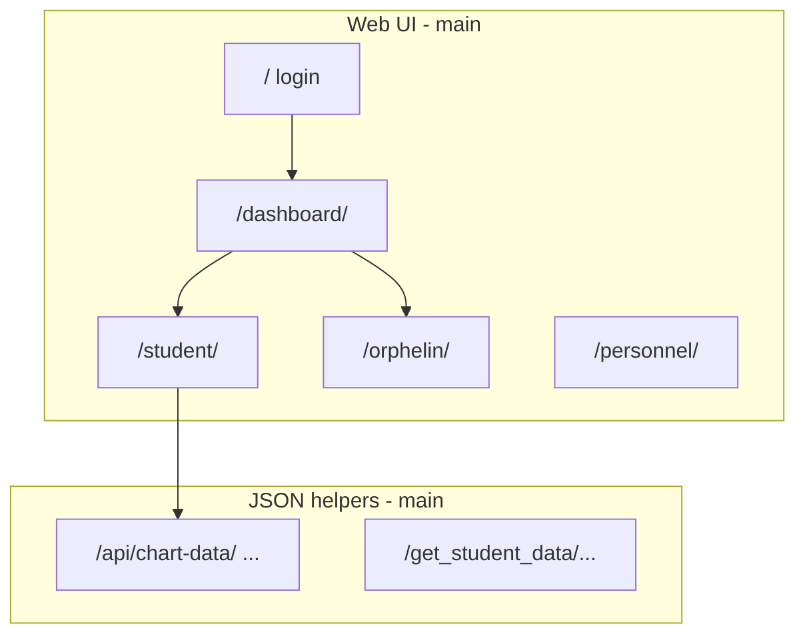

# FCRA Student Management System

Django application for managing students (étudiants), orphans, personnel, jamats, madrassahs, pensions, cemetery records, and related archives. The project exposes a **web UI** (`main`) and a **read-only REST API** plus **chatbot endpoints** (`api`).

---

## Stack

- **Python / Django 5.x**
- **Django REST Framework** + **django-filter** (API list filtering)
- **Google Gemini** (chatbot with function tools; requires `GEMINI_API_KEY`)
- Optional proxy to an **external deployment** of the same API (`EXTERNAL_API_BASE` in `api/views.py` for chatbot data helpers)

---

## High-level architecture



---

## Data model overview

**`Etudiant`** is the central entity. Many satellite tables use a `ForeignKey` to `Etudiant` (or wrap it for programs: Elite, Université, International, Sortant, etc.). **Django `User`** links to **`Profile`** (`OneToOne`). **Personnel** is separate from students and has **Conge** and **DossierPersonnel**.

```mermaid
erDiagram
  User ||--o| Profile : "OneToOne"
  Etudiant ||--o{ HistoriqueEtudiant : "historique"
  Etudiant ||--o{ Orphelin : "orphelin"
  Etudiant ||--o{ DossierUpload : "dossier"
  Etudiant ||--o{ NoteEtudiant : "notesetudiant"
  Etudiant ||--o{ Avertissement : ""
  Etudiant ||--o{ Presence : ""
  Etudiant ||--o{ Elite : "elite"
  Etudiant ||--o{ Universite : ""
  Etudiant ||--o{ Sortant : ""
  Etudiant ||--o{ Archive : "archive"
  Etudiant ||--o{ International : ""
  Etudiant ||--o{ HistoriqueSanteEtudiant : ""
  NoteEtudiant ||--o{ NoteElite : ""
  Personnel ||--o{ Conge : ""
  Personnel ||--o{ DossierPersonnel : ""
  Jamat ||--o{ ArchiveJamat : ""
  Madrassah ||--o{ ArchiveMadrassah : ""
  Pension ||--o{ DossierPension : ""
  Pension ||--o{ Paiementpension : ""
  Cimitiere ||--o{ DossierCimitiere : ""
  CenterAlias }o--|| "lookup" : "alias maps to main_center"
  ChatConversation }o--|| User : "FK"
  ChatConversation ||--o{ ChatMessage : "messages"
```



---

## Models (`main.models`)

| Model | Role | Main fields / notes |
|--------|------|---------------------|
| **CenterAlias** | Maps a center **alias** string to a **main** center (`addresschoice`). | `main_center`, `unique` `alias`. Used by `get_centre_choices()`. |
| **Etudiant** | Core student record. | `identifiant` (unique), `nom`, `date_naissance`, `genre`, contacts, `designation`, `fillier`, `Class`, `centre`, `status` (Actif/Inactif/Sortant), `institution`, `ville`, dates entrée/sortie, `imageprofile`. |
| **HistoriqueEtudiant** | History lines for a student. | `identifiant` → Etudiant, `date`, `raison`. |
| **Orphelin** | Orphan status + death certificate. | `identifiant` → Etudiant, `décedé`, `acte_de_décé` (file). |
| **DossierUpload** | Generic file attached to student. | `identifiant`, `namefile`, `file`. |
| **NoteEtudiant** | Grades / year summary. | Semesters `S1`–`S3`, `annee`, `moyen`, `rang`, `decision`, `examreussite`, `notesimage`; auto `orphelin` flag from Orphelin/Elite. |
| **Avertissement** | Warning / disciplinary note. | `identifiant`, `date`, `raison`. |
| **Presence** | Prayer attendance. | `identifiant`, `date`, `swalat` (Fajr/Maghrib), `presence` (P/A). |
| **Personnel** | Staff member. | `identifiant` (matricule, auto `PER#####`), `nom`, `genre`, `section`, `centre`, `travail`, `email`, `situation` (marital), `adress`, `imageprofile`. |
| **Conge** | Leave for personnel. | `identifiant` → Personnel, dates, `raison`, `statut` (type); **max 15 days/year** validated in `save()`. |
| **DossierPersonnel** | File for staff. | `identifiant` → Personnel, `namefile`, `file`. |
| **Jamat** | Community member (jamat). | `jamatid`, `nom`, demographics, `centre` (`CENTRE_JAMAT_CHOICES`), `imageprofile`. |
| **ArchiveJamat** | Archived jamat. | `jamat` → Jamat, `archive_type`, `raison`, `archived_at`. |
| **Madrassah** | Madrassah student. | `madrassahid`, `nom`, `centre` (subset), class fields, `parent`. |
| **ArchiveMadrassah** | Archived madrassah row. | `madrassah`, `raison`, `archived_at`. |
| **Profile** | Extended user profile. | `OneToOne` → `User`, `avatar`, `telephone`, `email`, `section`, `centre`, `job`. Created on user post_save. |
| **Pension** | Pension beneficiary. | `nom`, demographics, `pension` amount, `cause`, `nombre_enfants`, `date_pension`. |
| **DossierPension** | Pension document. | `pension` → Pension, file. |
| **Paiementpension** | Pension payment. | `pension`, `date_paiement`, `montant`, `statut`. |
| **Cimitiere** | Cemetery / deceased record. | `nom`, `date_deces`, `date_naissance`, `lieu_deces`, family contact fields, `imageprofile`. |
| **DossierCimitiere** | Cemetery document. | `cimitiere`, file. |
| **Elite** | Student flagged as Elite program. | `identifiant` → Etudiant. |
| **NoteElite** | Link note row to elite context. | `notes` → NoteEtudiant. |
| **Universite** | University-track extension. | `universite` → Etudiant, `email`. |
| **Sortant** | Alumni / leaver follow-up. | `sortant` → Etudiant, marital status, `placement_type`, job fields, `status` (Embauche / Non Embauche). |
| **Archive** | Archived student. | `archive` → Etudiant, `archive_type`, `raison`. |
| **International** | International mobility. | `international` → Etudiant, `pays`, `date_depart`, `duree_sejour` (years). |
| **HistoriqueSanteEtudiant** | Health log. | `identifiant` → Etudiant, `date`, `raison`, `observation`. |
| **ImageUpload** / **NotesUpload** | Simple upload placeholders. | Image fields only (legacy/auxiliary). |

### Models (`api.models`)

| Model | Role |
|--------|------|
| **ChatConversation** | `user` → User, `title`, `created_at`. |
| **ChatMessage** | `conversation` → ChatConversation, `is_user`, `content`, `timestamp`. |

---

## Web pages & routes (`main.urls`)

Routes are mounted at the **site root** (see `craStudentManagement/urls.py`: `path('', include('main.urls'))`).

### Auth & shell

| Path | Name | Purpose |
|------|------|---------|
| `/` | `loginSingup` | Login / signup entry |
| `/singin/` | `singin` | Sign-in |
| `/logout/` | `logoutUser` | Logout |
| `/dashboard/` | `home` | Main dashboard |
| `/orphelin/dashboard/` | `orphelin_dashboard` | Orphans dashboard |
| `/jamat/dashboard/` | `jamat_dashboard` | Jamat dashboard |
| `/elite/dashboard/` | `elite_dashboard` | Elite dashboard |
| `/etudiants/dashboard/` | `etudiants_dashboard` | Students dashboard |
| `/madrassah/dashboard/` | `madrassah_dashboard` | Madrassah dashboard |
| `/universite/dashboard/` | `universite_dashboard` | University dashboard |

### Students, notes, discipline, attendance

| Path | Name |
|------|------|
| `/student/` | `student` |
| `/student/archived/` | `archived_students` |
| `/student/<int:id>` | `studentdelete` |
| `/student/search`, `/student/groupby`, `/student/filter` | search / group / filter |
| `/student/edit`, `/student/upload`, `/student/view`, `/student/view/<str:etudiantid>` | CRUD / view |
| `/students/<str:etudiantid>` | `viewStudentMinimal` |
| `/notes/`, `/noteorphelin/`, `/notes/edit`, `/notes/<int:id>`, `/notes/GetId`, `/notes/showstat` | Grades |
| `/notes/search`, `/notes/filter` | Notes search/filter |
| `/avertissement/` (+ GetId, edit, `<int:id>`) | Warnings |
| `/presence/`, `/presence/GetId` | Attendance |

### Programs & archives

| Path | Name |
|------|------|
| `/orphelin/`, `/orphelin/edit`, `/orphelin/search`, `/orphelin/groupby`, `/orphelin/filter` | Orphans |
| `/orphelin/archive/` | `archived_orphelins` |
| `/elite/`, `/noteelite/` | Elite |
| `/elite/archive/` | `archived_elites` |
| `/universite/`, `/notesuniversite/`, `/universite/international/` | University |
| `/universite/archive/` | `archived_universites` |
| `/sortant/`, `/sortant/view/<int:sortant_id>/` | Alumni |
| `/jamat/`, `/viewjamat/<int:id>` | Jamat |
| `/jamat/archive/` | `archived_jamats` |
| `/madrassah/`, `/viewmadrassah/<str:id>` | Madrassah |
| `/madrassah/archive/` | `archived_madrassahs` |

### Personnel, documents, misc

| Path | Name |
|------|------|
| `/personnel/`, `/personnel/search`, `/personnel/<int:id>`, `/personnel/edit` | Staff |
| `/personnel/filter` | `PersonnelFilter` |
| `/viewpersonnel/<int:id>` | Detail |
| `/personnel/conge/gestion` | Leave management |
| `/viewdocument/<int:id>` | Document view |
| `/viewuser/`, `/profile/` | User profile |
| `/cimitiere/` (+ edit, search, filter, `<int:id>`, `view/<int:id>`) | Cemetery |
| `/get_cimitiere_data/<int:cimitiere_id>/` | Cemetery JSON |
| `/pension/` (+ edit, search, filter, `view/<int:id>`) | Pension |

### Dashboard AJAX / charts (JSON)

| Path | Name |
|------|------|
| `/dashboard/Getpass` | `getPassStat` |
| `/dashboard/Getbatch` | `getGetbatch` |
| `/dashboard/Getfillier` | `getGetfillier` |
| `/api/chart-data/` | `chart_data` |
| `/api/gender-distribution/` | `gender_distribution` |
| `/api/designation-distribution/` | `designation_distribution` |
| `/api/enrolled-institution-distribution/` | `enrolled_by_institution_distribution` |
| `/get_student_data/<int:student_id>/` | `get_student_data` |



---

## API documentation

Base URL for the **DRF router** is: **`/api/`** (`path('api/', include('api.urls'))`).

### Read-only resource API (ViewSets)

All use **GET** for list and detail. **List** supports **filtering** (`django-filter`) and **`search`** where noted.

| Resource | List URL | Detail URL | Lookup | Search fields |
|----------|----------|------------|--------|----------------|
| Students | `GET /api/etudiants/` | `GET /api/etudiants/{identifiant}/` | **`identifiant`** (string), not numeric PK | `nom` |
| Orphans | `GET /api/orphelins/` | `GET /api/orphelins/{id}/` | Primary key | `identifiant__nom` |
| International | `GET /api/international/` | `GET /api/international/{id}/` | Primary key | `international__nom`, `international__identifiant` |
| University rows | `GET /api/universite/` | `GET /api/universite/{id}/` | Primary key | `email`, `universite__nom`, `universite__identifiant` |

#### Query parameters (examples)

**`/api/etudiants/`** — `filterset_fields` (append lookups as in DRF filter syntax):

- `nom`, `nom__icontains`, `identifiant`, `genre`, `designation`, `institution`, `ville`, `Class`, `centre`, `status`, `telephone`, `nom_pere`, `nom_pere__icontains`, `nom_mere`, `nom_mere__icontains`, `telephone_mere`, `date_entre`, `date_entre__gte`, `date_entre__lte`

**`/api/orphelins/`** — plus custom:

- `age` — buckets: `3-10`, `11-14`, … `26+`, or ranges like `10-15`, or `less_than_15`, `greater_than_20`
- `acte_de_dece` — `complete` | `incomplete` (filters death certificate file presence)
- Standard: `décedé`, `identifiant__nom__icontains`, `identifiant__centre`, `identifiant__Class`, `identifiant__genre`, `identifiant__institution`, `identifiant__fillier`

**`/api/international/`** — e.g. `pays`, `date_depart__gte`, `duree_sejour__gte`, nested `international__*` filters as in `InternationalViewSet.filterset_fields`.

**`/api/universite/`** — `email`, `email__icontains`, `universite__date_entre__gte`, etc.

> **Permissions:** `REST_FRAMEWORK` in settings does not set `DEFAULT_PERMISSION_CLASSES`; ViewSets use DRF defaults unless overridden per view. **Lock down** with `IsAuthenticated` (or similar) in production.  
> **Chat** endpoints below explicitly require **`IsAuthenticated`**.

### Chatbot UI & conversation API

| Method | Path | Auth | Body / notes |
|--------|------|------|----------------|
| GET | `/api/chatbot/` | — | Renders HTML chat UI (`hide_sidebar`). |
| POST | `/api/chatbot/api/chat/` | **Yes** | JSON: `message` (required), `conversation_id` (optional). Returns `reply`, `conversation_id`, `conversation_title`. Uses Gemini with tools (`get_etudiants`, statistics, etc.). |
| GET | `/api/chatbot/api/conversations/` | **Yes** | Lists user’s `ChatConversation` rows. |
| GET | `/api/chatbot/api/conversations/<id>/` | **Yes** | `title` + `messages` list. |
| DELETE | `/api/chatbot/api/conversations/<id>/delete/` | **Yes** | Deletes one conversation. |
| DELETE | `/api/chatbot/api/conversations/delete-all/` | **Yes** | Deletes all conversations for user. |

### External API (chatbot helpers only)

`api/views.py` defines `EXTERNAL_API_BASE` (e.g. another FCRA instance). Helper functions `get_etudiants`, `get_orphelins`, `get_internationaux`, `get_universites` call:

- `{EXTERNAL_API_BASE}/api/etudiants/`
- `{EXTERNAL_API_BASE}/api/orphelins/`
- `{EXTERNAL_API_BASE}/api/international/`
- `{EXTERNAL_API_BASE}/api/universite/`

Those mirror the same query-style filters as the local DRF API when the remote server runs the same codebase.

### JSON endpoints on `main` (not under `/api/` prefix for student payload)

- `GET /get_student_data/<student_id>/` — student payload for UI/widgets (see `main.views.get_student_data`).

---

## Configuration

- **`GEMINI_API_KEY`** — required for chatbot (`python-decouple` / `.env`).
- **`EXTERNAL_API_BASE`** — optional remote API for chatbot tool calls (hardcoded default in `api/views.py`; override in code/env if you add support).
- **Media:** served via `MEDIA_URL` / `MEDIA_ROOT` in development (`craStudentManagement/urls.py`).

---

## Admin

- **`/admin/`** — Django admin; site title: **FCRA Management System**.

---

## Running (typical)

```bash
pip install -r requirements.txt   # if present; else install from pyproject/poetry as you use
python manage.py migrate
python manage.py createsuperuser
python manage.py runserver
```

*(Adjust for your project’s dependency file and database settings.)*

---

## Maintainer notes

- **`CenterAlias`** extends center pickers at runtime; migrations must exist before `get_centre_choices()` hits the DB.
- **`Conge.save`** enforces annual leave caps for **Personnel**.
- **`NoteEtudiant.save`** sets `orphelin` field from **Orphelin** / **Elite** membership.
- Model **`International`** is declared with a space before `(` in source (`class International (models.Model)`); behavior is unchanged but worth noting for imports/refactoring.

This README reflects the repository structure as of the documented `urls.py` and `models.py` files. If you add routes or serializers, update the tables and diagrams accordingly.
